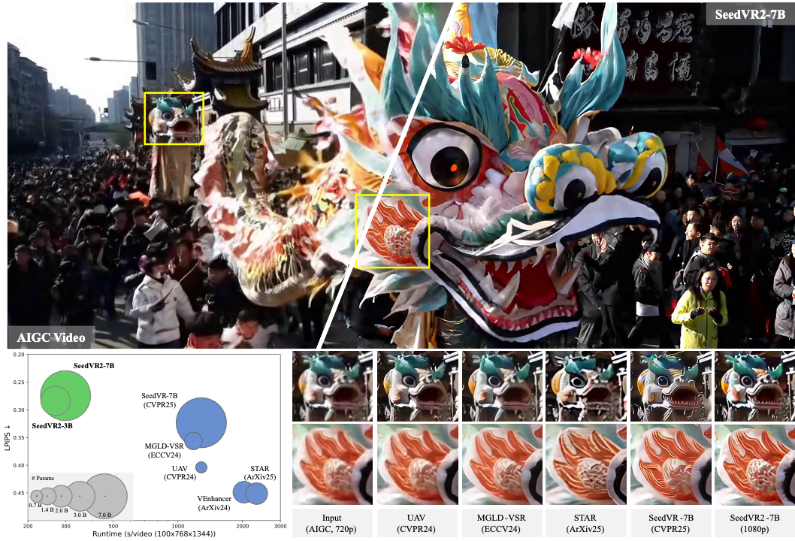

<div align="center">
  
</div>

# SeedVR: Seeding Infinity in Diffusion Transformer Towards Generic Video Restoration
> [Jianyi Wang](https://iceclear.github.io), [Zhijie Lin](https://scholar.google.com/citations?user=xXMj6_EAAAAJ&hl=zh-CN), [Meng Wei](https://openreview.net/profile?id=~Meng_Wei11), [Ceyuan Yang](https://scholar.google.com/citations?user=uPmTOHAAAAAJ&hl=zh-CN), [Fei Xiao](https://openreview.net/profile?id=~Fei_xiao8), [Chen Change Loy](https://www.mmlab-ntu.com/person/ccloy/), [Lu Jiang](http://www.lujiang.info/)
>
> **CVPR 2025 (Highlight)**

<p>
  <a href="https://iceclear.github.io/projects/seedvr/">
    
  </a>
  <a href="https://huggingface.co/collections/ByteDance-Seed/seedvr-6849deeb461c4e425f3e6f9e">
    
  </a>
   <a href="https://huggingface.co/spaces/ByteDance-Seed/SeedVR2-3B">
    
  </a>
  <a href="https://arxiv.org/abs/2501.01320">
    
  </a>
  <a href="https://www.youtube.com/watch?v=aPpBs_B2iCY" target='_blank'>
    
  </a>
</p>

>
> **Why SeedVR:** Conventional restoration models achieve inferior performance on both real-world and AIGC video restoration due to limited generation ability. Recent diffusion-based models improve the performance by introducing diffusion prior via ControlNet-like or adaptor-like architectures. Though gaining improvement, these methods generally suffer from constraints brought by the diffusion prior: these models suffer from the same bias as the prior, e.g., limited generation ability on small texts and faces, etc, and only work on fixed resolutions such as 512 or 1024. As a result, most of the existing diffusion-based restoration models rely on patch-based sampling, i.e., dividing the input video into overlapping spatial-temporal patches and fusing these patches using a Gaussian kernel at each diffusion step. The large overlap (e.g., 50\% of the patch size), required for ensuring a coherent output without visible patch boundaries, often leads to considerably slow inference speed. This inefficiency becomes even more pronounced when processing long videos at high resolutions. SeedVR follows SOTA video generation training pipelines to tackle the key challenge in diffusion-based restoration, i.e., by enabling arbitrary-resolution restoration w/o relying on any pretrained diffusion prior and introducing advanced video generation technologies suitable for video restoration. Serving as the largest-ever diffusion transformer model towards generic video restoration, we hope SeedVR could push the frontiers of advanced VR and inspire future research in developing large vision models for real-world video restoration.


# SeedVR2: One-Step Video Restoration via Diffusion Adversarial Post-Training
> [Jianyi Wang](https://iceclear.github.io), [Shanchuan Lin](https://scholar.google.com/citations?user=EDWUw7gAAAAJ&hl=en), [Zhijie Lin](https://scholar.google.com/citations?user=xXMj6_EAAAAJ&hl=en), [Yuxi Ren](https://scholar.google.com.hk/citations?user=C_6JH-IAAAAJ&hl=en), [Meng Wei](https://openreview.net/profile?id=~Meng_Wei11), [Zongsheng Yue](https://zsyoaoa.github.io/), [Shangchen Zhou](https://shangchenzhou.com/), [Hao Chen](https://haochen-rye.github.io/), [Yang Zhao](https://scholar.google.com/citations?user=uPmTOHAAAAAJ&hl=en), [Ceyuan Yang](https://ceyuan.me/), [Xuefeng Xiao](https://scholar.google.com/citations?user=CVkM9TQAAAAJ&hl=en), [Chen Change Loy](https://www.mmlab-ntu.com/person/ccloy/index.html), [Lu Jiang](http://www.lujiang.info/)

<p>
  <a href="https://iceclear.github.io/projects/seedvr2/">
    
  </a>
  <a href="https://huggingface.co/collections/ByteDance-Seed/seedvr-6849deeb461c4e425f3e6f9e">
    
  </a>
   <a href="https://huggingface.co/spaces/ByteDance-Seed/SeedVR2-3B">
    
  </a>
  <a href="http://arxiv.org/abs/2506.05301">
    
  </a>
  <a href="https://www.youtube.com/watch?v=tM8J-WhuAH0" target='_blank'>
    
  </a>
</p>

>
> Recent advances in diffusion-based video restoration (VR) demonstrate significant improvement in visual quality, yet yield a prohibitive computational cost during inference. While several distillation-based approaches have exhibited the potential of one-step image restoration, extending existing approaches to VR remains challenging and underexplored, due to the limited generation ability and poor temporal consistency, particularly when dealing with high-resolution video in real-world settings. In this work, we propose a one-step diffusion-based VR model, termed as SeedVR2, which performs adversarial VR training against real data. To handle the challenging high-resolution VR within a single step, we introduce several enhancements to both model architecture and training procedures. Specifically, an adaptive window attention mechanism is proposed, where the window size is dynamically adjusted to fit the output resolutions, avoiding window inconsistency observed under high-resolution VR using window attention with a predefined window size. To stabilize and improve the adversarial post-training towards VR, we further verify the effectiveness of a series of losses, including a proposed feature matching loss without significantly sacrificing training efficiency. Extensive experiments show that SeedVR2 can achieve comparable or even better performance compared with existing VR approaches in a single step.

<p align="center"></p>


## 📢 News

We sincerely thank all contributors from the open community for their valuable support.

- **June, 2025:** Repo created.


## 📮 Notice
**Limitations:** These are the prototype models and the performance may not perfectly align with the paper. Our methods are sometimes not robust to heavy degradations and very large motions, and shares some failure cases with existing methods, e.g., fail to fully remove the degradation or simply generate unpleasing details. Moreover, due to the strong generation ability, Our methods tend to overly generate details on inputs with very light degradations, e.g., 720p AIGC videos, leading to oversharpened results occasionally (especially on small resolutions, e.g., 480p).


## 🔥 Quick Start

1️⃣  Set up environment

```bash
git clone https://github.com/ByteDance-Seed/SeedVR.git
cd SeedVR
conda create -n seedvr python=3.10 -y
conda activate seedvr
pip install -r requirements.txt
pip install flash_attn==2.5.9.post1 --no-build-isolation
```

Install [apex](https://github.com/NVIDIA/apex).
If you encounter problems when installing apex from source, we provide two pre-build whl here:
- [apex-0.1-cp39-cp39-linux_x86_64.whl](https://huggingface.co/ByteDance-Seed/SeedVR2-3B/resolve/main/apex-0.1-cp39-cp39-linux_x86_64.whl): for python=3.9, torch=2.4.0, cuda=12.4
- [apex-0.1-cp310-cp310-linux_x86_64.whl](https://huggingface.co/ByteDance-Seed/SeedVR2-3B/resolve/main/apex-0.1-cp310-cp310-linux_x86_64.whl): for python=3.10, torch=2.4.0, cuda=12.1
```bash
pip install apex-0.1-cp310-cp310-linux_x86_64.whl
```

### 🍎 macOS Setup

For macOS users with Apple Silicon (M1/M2/M3 chips), follow these steps. This version uses MPS for acceleration and includes necessary fallbacks for compatibility.

```bash
git clone https://github.com/zettai-seigi/SeedVR.git
cd SeedVR
conda create -n seedvr python=3.10 -y
conda activate seedvr

# Install PyTorch with MPS support
pip install torch torchvision torchaudio

# Install macOS-specific requirements
pip install -r requirements_macos.txt
```
**Note:** You do not need to install `flash_attn` or `apex` on macOS, as compatible shims are included.


To use color fix, put the file [color_fix.py](https://github.com/pkuliyi2015/sd-webui-stablesr/blob/master/srmodule/colorfix.py) to `./projects/video_diffusion_sr/color_fix.py`.


2️⃣  Download pretrained checkpoint

run the download_model.py

or

```python

# Take SeedVR2-3B as an example.
# See all models: https://huggingface.co/models?other=seedvr

from huggingface_hub import snapshot_download

save_dir = "ckpts/"
repo_id = "ByteDance-Seed/SeedVR2-3B"
cache_dir = save_dir + "/cache"

snapshot_download(cache_dir=cache_dir,
  local_dir=save_dir,
  repo_id=repo_id,
  local_dir_use_symlinks=False,
  resume_download=True,
  allow_patterns=["*.json", "*.safetensors", "*.pth", "*.bin", "*.py", "*.md", "*.txt"],
)

```

## 🔥 Inference

You need to set the related settings in the inference files.      

**GPU Requirement:** We adopt sequence parallel to enable multi-GPU inference and 1 H100-80G can handle videos with 100x720x1280. 4 H100-80G further support 1080p and 2K videos (sp_size=4). We will support more inference tricks like [Tile-VAE](https://github.com/pkuliyi2015/multidiffusion-upscaler-for-automatic1111) and [Progressive Aggregation Sampling](https://github.com/IceClear/StableSR) in the future.      

```python
# Take 3B SeedVR2 model inference script as an example
torchrun --nproc-per-node=NUM_GPUS projects/inference_seedvr2_3b.py --video_path INPUT_FOLDER --output_dir OUTPUT_FOLDER --seed SEED_NUM --res_h OUTPUT_HEIGHT --res_w OUTPUT_WIDTH --sp_size NUM_SP
```

### 🍎 macOS Inference

For macOS, use the dedicated inference script. It runs on a single device (CPU or MPS) and does not support sequence parallelism (`sp_size` is ignored).

```bash
python projects/inference_seedvr2_3b_macos.py --video_path INPUT_FOLDER --output_dir OUTPUT_FOLDER --seed SEED_NUM --res_h OUTPUT_HEIGHT --res_w OUTPUT_WIDTH
```
or run the gradio_ui.py

## ✍️ Citation

```bibtex
@article{wang2025seedvr2,
      title={SeedVR2: One-Step Video Restoration via Diffusion Adversarial Post-Training},
      author={Wang, Jianyi and Lin, Shanchuan and Lin, Zhijie and Ren, Yuxi and Wei, Meng and Yue, Zongsheng and Zhou, Shangchen and Chen, Hao and Zhao, Yang and Yang, Ceyuan and Xiao, Xuefeng and Loy, Chen Change and Jiang, Lu},
      booktitle={arXiv preprint arXiv:2506.05301},
      year={2025}
   }

@inproceedings{wang2025seedvr,
      title={SeedVR: Seeding Infinity in Diffusion Transformer Towards Generic Video Restoration},
      author={Wang, Jianyi and Lin, Zhijie and Wei, Meng and Zhao, Yang and Yang, Ceyuan and Loy, Chen Change and Jiang, Lu},
      booktitle={CVPR},
      year={2025}
   }
```


## 📜 License
SeedVR and SeedVR2 are licensed under the Apache 2.0.
